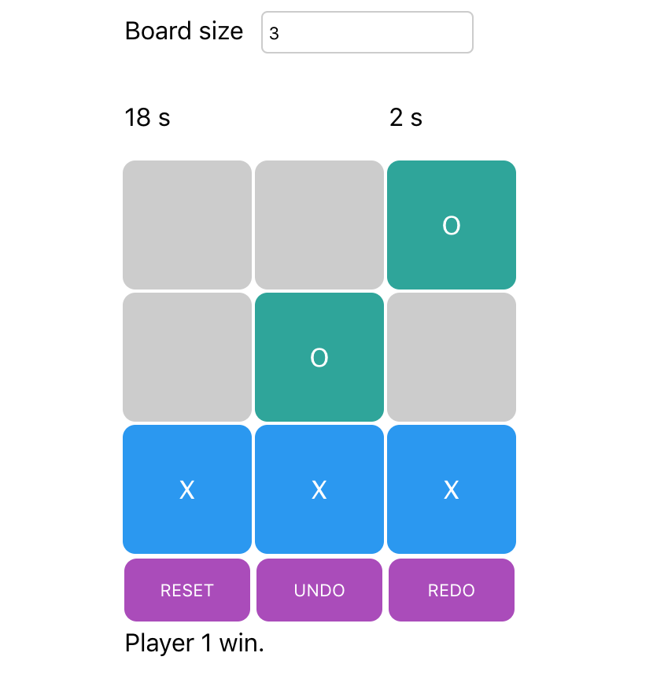

# React hooks example

A simple tic tac toe game made with React 16.7.



## Installation

Just do the classic clone/install/start commands:

```
~$ git clone https://github.com/dispix/react-hooks-example
~$ cd react-hooks-example
~$ yarn
~$ yarn start
```
